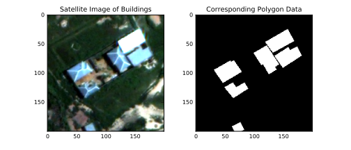

# MATH-651-Project
Place for our project.

## Introduction
With the development of sciences and technology, we have a growing number of high resolution satellite images.
This help us get a better understanding of the Earth.
Labelling features such us water, farms, roadways, and artificial structures in satellite images has been became an important task.
At present, this labelling work is still mainly done by hand and semi-automated algorithms.
Our program is aim to provide a reliable automated labelling algorithm and a work flow especially focus on building recognition in satellite images.
<!-- With more and more complex image data we have, a reliable automated algorithm is needed. -->

## Statement of Problem
On December 15, 2016, the Defence Science and Technology Laboratory (Dstl) has started up a competition on Kaggle.com, seeking automated labelling algorithms to alleviate the burden on their image analysts.
The datasets they provided are containing three band remote sensing images, sixteen band remote sensing images, object locations and types.
All the datasets can be used for generating the labelling algorithm and then verify the algorithm accuracy.
In our program, we will only focus on the the labelling algorithm for recognize building on satellite images.

<!-- Problem 1: we are not working with single pixel. -->
There are many problems when we conduct image recognize algorithm on buildings.
Single pixel contain brightness and colour informations, and this can play a large role in recognize the areas such as water, road, crops, etc.
But when working on buildings, we need to process pieces of small images.
The attention needs to be paid on geometry structures of buildings, instead of colour and texture features.
<!-- Problem 2: Training set will be very complex and large. The images for same building in different meteorological conditions and shooting angles are different. -->
Another concern is the training set for pattern recognition could be very complex and large.
The images for same building in different meteorological conditions and shooting angles can be very different.
In order to solve this problem, more images under different situations in the training set will be needed.
However, this image data will be very hard to achieve because of the limitations of satellite remote sensing.

Above figure shows the datasets we have.
Left figure is a piece of three band satellite image, several buildings has been shown in this figure.
Right figure is its corresponding polygon data.

## Objectives
Our objective is to come up with an algorithm and a work flow for automatically labelling buildings in satellite images without the polygon data.
First, we will study image edge detection algorithms, and apply the algorithm on satellite images.
Then, we will apply convolutional neural network to identify buildings in the images.

## Edge detection algorithms
Image edge plays an important role in pattern recognition.
Edge detection is an essential component in many computer vision problems.
Suppose $f(x_1,x_2)$ is an image, the gradient vector is
$$∇ f = \left( \frac{∂ f}{∂ x_1}, \frac{∂ f}{∂ x_2} \right).$$
Let $x = y + λ ∇ f(y)$ and $|λ|$ is small enough, $y$ is an edge point if $|∇ f(x)|$ is locally maximum.
Canny Edge Detection algorithm is one of the most popular edge detection algorithm and we will apply that algorithm on the satellite images.
We may not only analysis image edges in greyscale, but also consider working on RGB colour scale which could be better for describing feature of buildings.

## Convolutional neural network
Neural networks are algorithms that mimic biological nervous systems. In convolutional neural networks, input data is sent through various processing layers and a single output, or class, is generated. Through this process, input data is classified according to features in the data. Each processing layer assigns weights to data features. For the present task of classifying buildings in satellite images, we will use a supervised neural network, which means that the network will first be 'trained' with pre-labelled data in order to obtain the correct weights. We will then test the algorithm on non-labelled data to evaluate its accuracy.

## Management Plan
There are some separated work:

1. Visualization module: show the image and the object polygon.
2. Edge detection algorithm: mainly based on the Canny edge detector.
<!-- 3. Unsupervised learning method: such as k-means and SVM, generate a pipline for analysis satellite images. -->
3. Convolutional neural network: we may can consider using polygon file directly as a training set.

## Conclusion

## References
- https://www.kaggle.com/c/dstl-satellite-imagery-feature-detection
- Canny J. A computational approach to edge detection[J]. IEEE Transactions on pattern analysis and machine intelligence, 1986 (6): 679-698.
- Lindeberg T. Edge detection and ridge detection with automatic scale selection[J]. International Journal of Computer Vision, 1998, 30(2): 117-156.
- Mallat S. A wavelet tour of signal processing: the sparse way[M]. Academic press, 2008.
